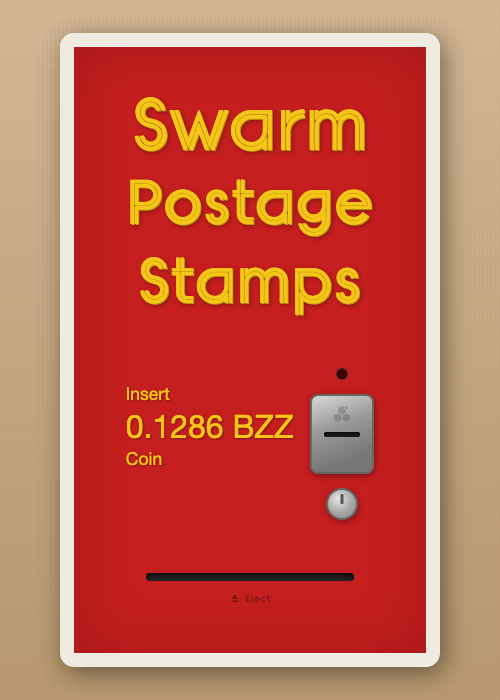

# Stamp Machine

A web-based Swarm postage stamp vending machine, styled after a vintage Royal Mail stamp dispenser. Insert a coin (connect your wallet), and out drops a Book of Stamps — a portable key file containing a freshly purchased postage batch and the ephemeral wallet that owns it.



## How it works

1. **Insert coin** — Click the coin slot to connect your wallet via WalletConnect (Gnosis chain)
2. **Generate wallet** — The machine creates a fresh ephemeral secp256k1 keypair from browser-native cryptographic entropy. This key is used solely for stamping — it holds no funds and should not be used for any other purpose.
3. **Purchase batch** — Two transactions are sent from your connected wallet:
   - `BZZ.approve()` — approve the PostageStamp contract to spend BZZ tokens
   - `PostageStamp.createBatch()` — create a new batch owned by the ephemeral wallet
4. **Collect booklet** — A Book of Stamps file drops into the collection tray and downloads to your device. Each book contains a unique ephemeral key tied to that batch alone.

## Book of Stamps format

The downloaded file uses the Book of Stamps portable key file format:

```
-----BEGIN BOOK OF STAMPS-----
Version: 1
Batch-Id: 7f9bae3b2ca293c5e696add592f86a8f...
Owner: 3ff22130c2ef603bb97828f509e2953c...
Depth: 20
Bucket-Depth: 16
Amount: 1000000000
Usage: 0/1048576

<base64-encoded private key>
-----END BOOK OF STAMPS-----
```

When buckets have been used, the `Usage` header includes trie-encoded bucket state in xxd format:

```
Usage: 5/1048576 42 bytes
00000000: 0500 0000 0000 0000 0000 0000 0000 0000  ................
00000010: 0000 0000 0000 0000 0000 0000 0000 0000  ................
```

Import this file into any Swarm application to start uploading with the purchased batch.

## Chain details

| | |
|---|---|
| **Chain** | Gnosis (100) |
| **PostageStamp** | `0x45a1502382541Cd610CC9068e88727426b696293` |
| **BZZ Token** | `0xdBF3Ea6F5beE45c02255B2c26a16F300502F68da` |
| **RPC** | `https://rpc.gnosis.gateway.fm` |
| **Batch depth** | 20 (1,048,576 chunks) |
| **Bucket depth** | 16 |
| **Amount** | 1,000,000,000 plurs/chunk |

## Development

```bash
npm install
npm run dev       # Vite dev server on :5176
npm test          # Unit tests (vitest)
npm run test:integration  # Playwright integration tests
npm run build     # Single-file production build → dist/index.html
```

## Architecture

Vanilla TypeScript, no framework. Follows the same patterns as [dadamdada](https://github.com/significance/dada-editable-js).

```
src/
├── main.ts        # State machine: IDLE → CONNECTING → APPROVING → CREATING → DISPENSING
├── wallet.ts      # AppKit/Reown wallet connection for Gnosis chain
├── batch.ts       # ABI encoding, approve + createBatch, receipt polling
├── keygen.ts      # Ephemeral secp256k1 wallet from Web Crypto API
├── stampbook.ts   # Serialize/deserialize Book of Stamps PEM format
├── download.ts    # Trigger file download
└── animation.ts   # CSS transition orchestration
```

Built with `vite-plugin-singlefile` — the production build is a single self-contained HTML file.
